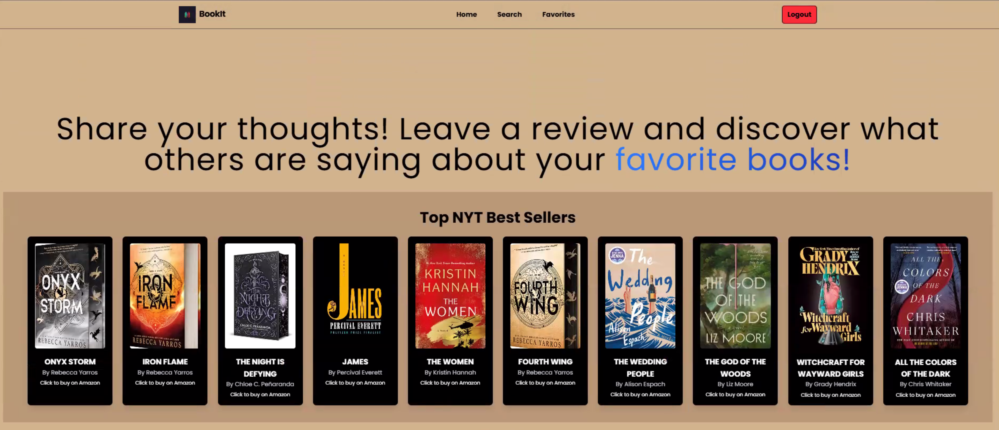

# Team-Book-It

## Description
📝
Book-It is a full-stack web application that allows users to search for books, leave reviews, and 
get favorite book recommendations. The app integrates with the different API to fetch book
details and provides a platform for users to share their reading experiences. Users can create 
accounts, favorite books, and explore recommendations based on their reading preferences.
## App Link
📽️- [Deploy Link of Book-It application](https://team-book-it.onrender.com/)  
## 🎨 **Mock-Up**

### Table of Contents 📋
[Installation](#installation) 
[Usage](#usage) 
[Contributor](#contributor) 
[License](#license) 
[Contributing](#contributing) 
[Tests](#tests) 
[Questions](#questions) 
## Installation
💽
Install the dependencies required to launch the application. PostgreSQL, Node js, Express, and React.
## Usage
🖱️
Navigate the list of New York Times best seller APIs to open an amazon url to purchase the book if you want. If you want to leave a review or favorite a book, Register and Login.

## Contributors ✍️
(https://github.com/KyBrMar12) - Kyle Marcak 
(https://github.com/Riccoli1) - Monique Quinones 
(https://github.com/Deetoe) - Daniel Gonzalez 
(https://github.com/Lancetron) - Lance Anderson 
(https://github.com/abraham757) - Abrahan Gonzalez 

## License
This project is licensed under the [MIT License](https://opensource.org/licenses/MIT).

## How to Contribute
Any developers can contribute under the MIT license. 
## Tests
🖥️
You may test the code by clicking the deploy link to Render or by executing the terminal commands to get a psql, backend, and frontend terminal running. 
## Questions
❓
For questions please contact the developers  at  
[KyBrMar12](https://github.com/KyBrMar12) - has 16 repositories available. Follow their code on GitHub. 
[Riccoli1](https://github.com/Riccoli1) - has one repository available. Follow their code on GitHub. 
[Deetoe](https://github.com/Deetoe) - has 10 repositories available. Follow their code on GitHub. 
[lancetron](https://github.com/Lancetron) - has 5 repositories available. Follow their code on GitHub. 
[abraham757](https://github.com/abraham757) - has 23 repositories available. Follow their code on GitHub. 